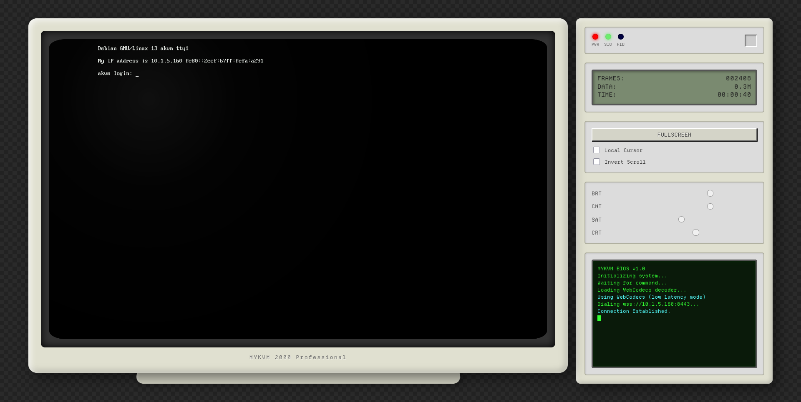
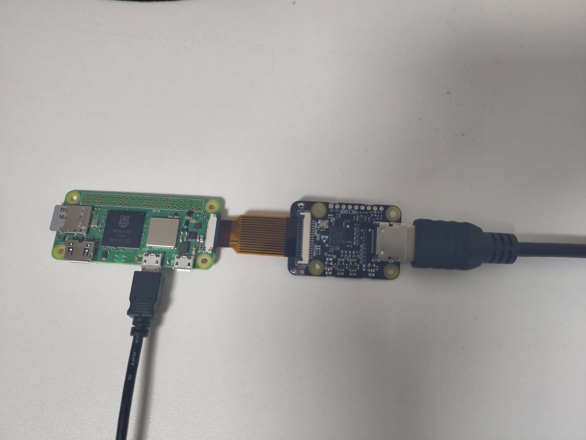

# zeropykvm

A KVM-over-IP solution running on Raspberry Pi Zero 2 W — rewritten from [Zig](https://github.com/darkyzhou/mykvm) to Python.

> **Attribution:** This project is a Python port of [darkyzhou/mykvm](https://github.com/darkyzhou/mykvm), originally written in Zig. All credit for the architecture and design goes to the original author.

## Features

- **Zero-copy video pipeline**: Uses Linux DMA-BUF to share buffers between capture device (TC358743) and hardware H.264 encoder (bcm2835-codec)
- **USB HID gadget**: Emulates USB keyboard and mouse via Linux ConfigFS, with Boot Protocol support for BIOS compatibility
- **HTTPS + WebSocket**: Serves a web frontend over HTTPS with WebSocket for real-time video streaming and HID control
- **E-Paper display**: Optional status display on Waveshare EPD 2in13 V4

## Demo hardware

- [Raspberry Pi Zero 2 W](https://rpishop.cz/raspberry-pi-zero/4311-raspberry-pi-zero-2-w.html) ([Archive](https://web.archive.org/web/20241129185458/https://rpishop.cz/raspberry-pi-zero/4311-raspberry-pi-zero-2-w.html))
- [Waveshare HDMI-CSI Adapter](https://rpishop.cz/mipi/3795-waveshare-hdmi-csi-adapter-pro-raspberry-pi.html) ([Archive](https://web.archive.org/web/20241120194451/https://rpishop.cz/mipi/3795-waveshare-hdmi-csi-adapter-pro-raspberry-pi.html))
- [Raspberry Pi Zero Camera Cable (38 cm)](https://rpishop.cz/mipi/695-raspberry-pi-zero-kamera-kabel-38-cm.html) ([Archive](https://web.archive.org/web/20230528221841/https://rpishop.cz/mipi/695-raspberry-pi-zero-kamera-kabel-38-cm.html))

## Screenshots





## Architecture

The Python rewrite mirrors the original Zig project's architecture:

| Module | Description |
|--------|--------------|
| `args.py` | CLI argument parsing (argparse) |
| `utils.py` | Utility functions (ioctl wrapper, IP detection, FourCC) |
| `v4l2.py` | V4L2 constants, ioctl numbers, and ctypes structures |
| `dma.py` | DMA heap allocation and buffer management |
| `edid.py` | EDID setting and HDMI signal detection |
| `capture.py` | V4L2 capture device with DMABUF support |
| `encode.py` | V4L2 M2M H.264 encoder with DMABUF input |
| `usb.py` | USB HID gadget setup, keyboard/mouse emulation |
| `epaper.py` | E-Paper display driver |
| `http_handler.py` | HTTP static file serving |
| `server.py` | WebSocket client management and broadcast |
| `ws_handler.py` | WebSocket message handling (keyboard/mouse events) |
| `https_server.py` | HTTPS/TLS server with WebSocket upgrade |
| `video.py` | Zero-copy video pipeline orchestration |
| `gencert.py` | Self-signed certificate generator (`zeropykvm gencrt` subcommand) |
| `main.py` | Main entry point |

## Requirements

- Python >= 3.12
- Linux with V4L2 support (Raspberry Pi OS recommended)
- TC358743 HDMI capture device
- bcm2835-codec hardware encoder
- USB gadget support (dwc2 overlay)
- [uv](https://docs.astral.sh/uv/) (recommended for dependency management)

## Installation

```bash
# Install from PyPI using uv (recommended)
uv tool install zeropykvm

# Or with pip
pip install zeropykvm

# With e-Paper display support (on Raspberry Pi)
pip install zeropykvm[epaper]
```

### Development setup

```bash
git clone https://github.com/YOUR_USERNAME/mykvm-python.git
cd mykvm-python
uv sync

# With development tools
uv sync --extra dev

# With e-Paper display support (on Raspberry Pi)
uv sync --extra epaper
```

## Usage

```bash
# Generate a self-signed TLS certificate (no openssl required)
zeropykvm gencrt --cert cert.pem --key key.pem

# Run zeropykvm
zeropykvm --cert cert.pem --key key.pem

# With custom settings
zeropykvm --cert cert.pem --key key.pem --port 443 --bitrate 2000000
```

Then open `https://<pi-ip>:8443/` in a browser and accept the self-signed certificate.

## Testing

```bash
# Run all tests
uv run pytest

# Run with verbose output
uv run pytest -v

# Run specific test module
uv run pytest tests/test_usb.py -v
```

## License

This project follows the same license as the original [mykvm](https://github.com/darkyzhou/mykvm).